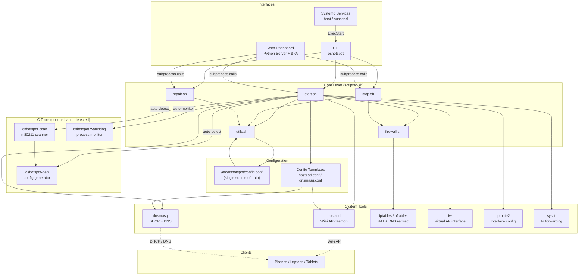
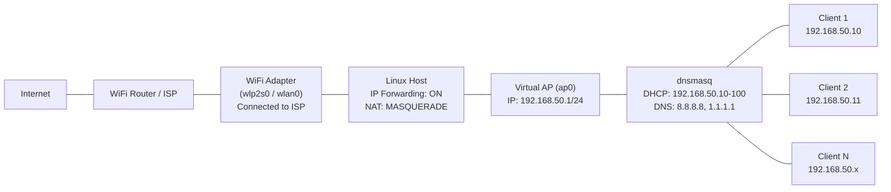
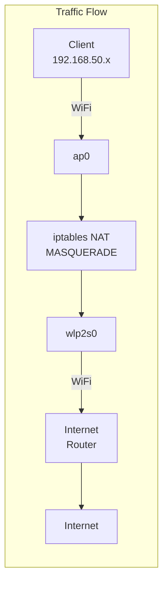
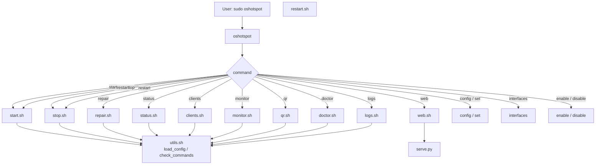
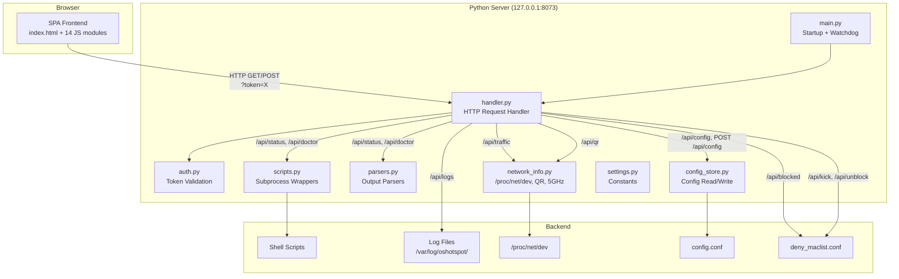
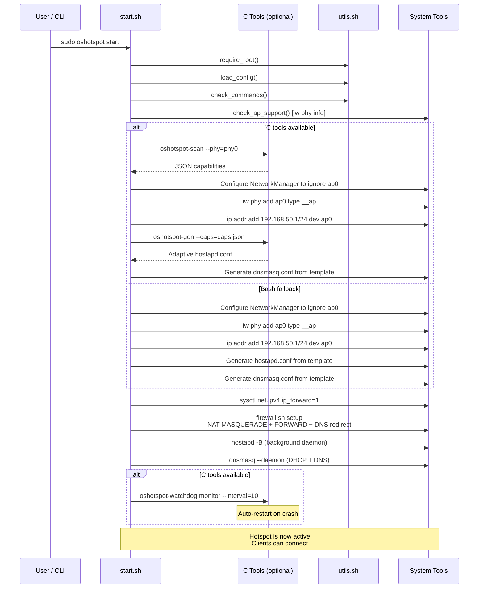
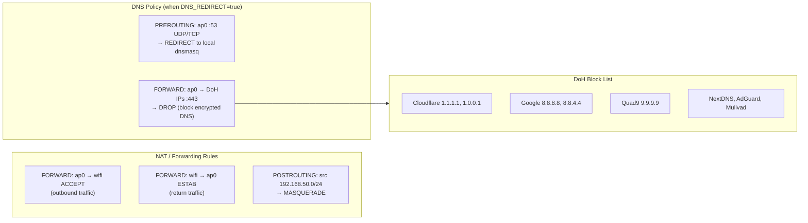
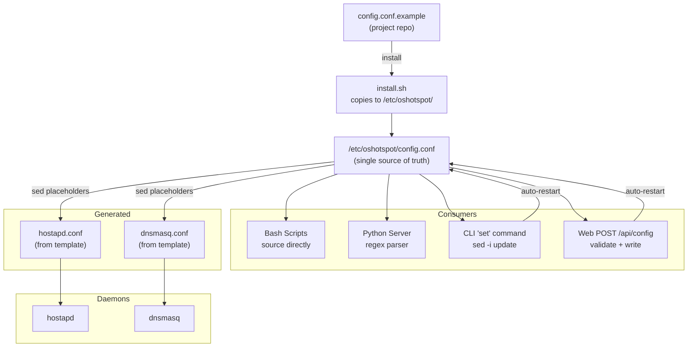
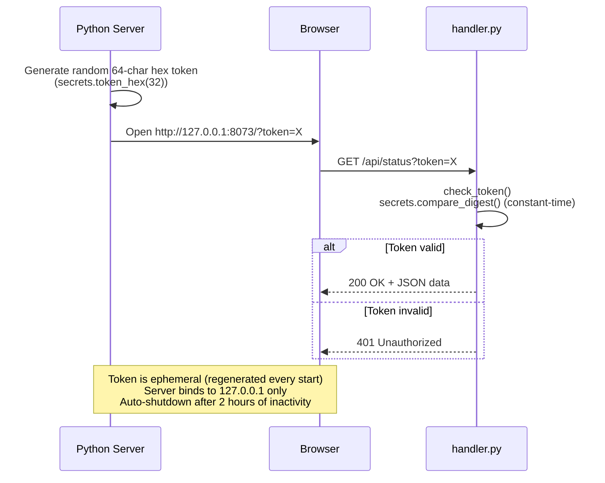

# Architecture

OSHotspot is a WiFi hotspot manager for Linux that creates a virtual Access Point using a single WiFi adapter, sharing the host machine's internet connection with clients via NAT. It provides both a CLI and a local web dashboard for management.

---

## System Overview



---

## Network Topology





---

## CLI Flow

The CLI is a Bash script dispatcher that routes commands to dedicated shell scripts.



---

## Web Dashboard Flow

The web dashboard is a Python HTTP server serving a vanilla JS SPA. All API calls are token-authenticated.



### API Endpoints

| Method | Path | Backend | Description |
|--------|------|---------|-------------|
| GET | `/api/status` | `status.sh` + `clients.sh` | Full hotspot status |
| GET | `/api/clients` | `clients.sh` | DHCP lease table |
| GET | `/api/config` | `config_store.py` | Current configuration |
| GET | `/api/qr` | `qrencode` | WiFi QR code PNG |
| GET | `/api/doctor` | `doctor.sh` | System diagnostics |
| GET | `/api/logs` | Log files | Hostapd/dnsmasq/web logs |
| GET | `/api/traffic` | `/proc/net/dev` | Bandwidth counters |
| GET | `/api/interfaces` | `/sys/class/net` | WiFi interface list |
| GET | `/api/blocked` | `deny_maclist.conf` | Blocked MACs |
| POST | `/api/start` | `start.sh` | Start hotspot |
| POST | `/api/stop` | `stop.sh` | Stop hotspot |
| POST | `/api/restart` | `stop.sh` + `start.sh` | Restart hotspot |
| POST | `/api/repair` | `repair.sh` | Post-suspend recovery |
| POST | `/api/config` | `config_store.py` | Update configuration |
| POST | `/api/kick` | `deny_maclist.conf` | Block client by MAC |
| POST | `/api/unblock` | `deny_maclist.conf` | Unblock client |

---

## Start Sequence

The startup process follows a strict 13-step sequence.



---

## Firewall Architecture

OSHotspot supports both **iptables** and **nftables** backends, auto-detected at runtime.



---

## Configuration Management

`config.conf` is the single source of truth, in shell-sourced `KEY="value"` format.



### Configuration Parameters

| Key | Default | Description |
|-----|---------|-------------|
| `SSID` | `OSHotspot` | WiFi network name (1-32 chars) |
| `PASSWORD` | `ChangeMe123` | WiFi password (min 8 chars, WPA2) |
| `CHANNEL` | `6` | WiFi channel (1-13) |
| `HW_MODE` | `g` | Hardware mode (`g` = 2.4GHz, `a` = 5GHz) |
| `COUNTRY_CODE` | `FR` | ISO 3166-1 alpha-2 country code |
| `HOSTNAME` | `oshotspot` | Hostname shown on the network |
| `AP_IFACE` | `ap0` | Virtual AP interface name |
| `WIFI_IFACE` | *(auto-detected)* | Internet WiFi interface |
| `AP_IP` | `192.168.50.1` | Hotspot gateway IP |
| `SUBNET` | `192.168.50.0` | Hotspot subnet |
| `AP_CIDR` | `24` | Subnet CIDR prefix |
| `DHCP_RANGE_START` | `192.168.50.10` | DHCP range start |
| `DHCP_RANGE_END` | `192.168.50.100` | DHCP range end |
| `DHCP_LEASE` | `12h` | DHCP lease duration |
| `DNS_PRIMARY` | `8.8.8.8` | Primary DNS server |
| `DNS_SECONDARY` | `1.1.1.1` | Secondary DNS server |

---

## Security Model

### Token Authentication



### Security Layers

| Layer | Mechanism |
|-------|-----------|
| Network binding | `127.0.0.1` only (no external access) |
| Authentication | Random 256-bit token, constant-time comparison |
| Token delivery | URL query parameter (`?token=...`) |
| Request validation | Every API call requires valid token |
| Security headers | `X-Content-Type-Options: nosniff`, `X-Frame-Options: DENY` |
| Password protection | WiFi password never returned via API (only `password_set: boolean`) |
| File permissions | `config.conf` and `hostapd.conf` are `chmod 600` |
| Inactivity timeout | Auto-shutdown after 2 hours (out-of-process watchdog) |
| MAC filtering | `deny_maclist.conf` for kick/block clients |
| DNS enforcement | PREROUTING redirect + DoH IP blocking |

---

## File Structure

```
OSHotspot/
├── oshotspot                    # CLI entry point (bash)
├── Makefile                     # Build system for C tools
├── install.sh                   # Installer (local or remote)
├── uninstall.sh                 # Uninstaller (--purge option)
├── config.conf.example          # Configuration template
├── agents.json                  # AI agent metadata
├── include/
│   └── oshotspot.h              # Shared C types
├── src/
│   ├── oshotspot-scan.c         # nl80211 WiFi scanner
│   ├── oshotspot-gen.c          # Adaptive config generator
│   └── oshotspot-watchdog.c     # Process watchdog
├── scripts/
│   ├── utils.sh                 # Shared functions, config loader
│   ├── start.sh                 # Hotspot startup (13 steps)
│   ├── stop.sh                  # Hotspot shutdown
│   ├── repair.sh                # Post-suspend recovery
│   ├── firewall.sh              # iptables/nftables NAT setup
│   ├── status.sh                # System status report
│   ├── clients.sh               # DHCP lease table
│   ├── monitor.sh               # Real-time CLI monitoring
│   ├── qr.sh                    # Terminal QR code
│   ├── doctor.sh                # System diagnostics
│   ├── logs.sh                  # Log viewer
│   └── web.sh                   # Launches Python server
├── configs/
│   ├── hostapd.conf.template    # hostapd config template
│   ├── dnsmasq.conf.template    # dnsmasq config template
│   └── nm-oshotspot.conf        # NetworkManager ignore ap0
├── systemd/
│   ├── oshotspot.service        # Main systemd unit
│   └── oshotspot-dnsmasq.service # Dedicated dnsmasq unit
├── completions/
│   ├── oshotspot                # Bash completion
│   ├── oshotspot.zsh            # Zsh completion
│   └── oshotspot.fish           # Fish completion
└── web/
    ├── serve.py                 # Python entry point
    ├── server/
    │   ├── main.py              # Server startup + watchdog
    │   ├── handler.py           # HTTP API routes
    │   ├── auth.py              # Token management
    │   ├── scripts.py           # Subprocess wrappers
    │   ├── parsers.py           # Output parsers
    │   ├── config_store.py      # Config read/write/validate
    │   ├── network_info.py      # /proc/net/dev, QR, 5GHz
    │   └── settings.py          # Constants
    └── static/
        ├── index.html           # SPA shell (9 views)
        ├── style.css            # Styles (dark/light themes)
        └── js/
            ├── core.js          # Shared state + DOM helpers
            ├── api.js           # Fetch wrapper + token injection
            ├── app.js           # Bootstrap + polling
            ├── nav.js           # SPA navigation
            ├── theme.js         # Dark/light toggle
            ├── toast.js         # Notifications
            ├── status.js        # Overview panel
            ├── clients.js       # Client table + kick/block
            ├── actions.js       # Start/stop/restart/repair
            ├── config.js        # Configuration form
            ├── traffic.js       # Bandwidth chart (Canvas)
            ├── doctor.js        # Diagnostics panel
            ├── qr.js            # QR code display
            └── logs.js          # Log viewer
```

---

## Key Architectural Decisions

1. **Zero dependencies** — The Python server uses only stdlib (`http.server`, `json`, `subprocess`). No pip packages required.

2. **Single source of truth** — `config.conf` is a shell-sourced `KEY="value"` file, readable by both Bash (`source`) and Python (regex parser).

3. **Scripts as execution layer** — All system operations go through Bash scripts. Both CLI and web server are thin dispatchers invoking the same scripts.

4. **Template-based config generation** — hostapd.conf and dnsmasq.conf are regenerated from templates on every start, ensuring they always match current config.

5. **Virtual AP interface** — `ap0` is created via `iw`, allowing the same physical adapter to serve both client connection and AP roles simultaneously.

6. **Dual firewall backend** — Auto-detection of iptables vs nftables for cross-distribution compatibility.

7. **DNS policy enforcement** — Two-layer approach: PREROUTING redirect for standard DNS, FORWARD DROP for DoH bypass prevention.

8. **Out-of-process watchdog** — Inactivity timeout runs as a separate subprocess, continuing even if the main server is blocked.

9. **ThreadingHTTPServer** — Long-running scripts don't block status polling and other API requests.

10. **Auto-restart on config change** — Both CLI and web dashboard automatically restart the hotspot after configuration updates.

11. **Graceful degradation** — C tools are optional. If not compiled (missing gcc or libnl), bash fallback handles everything. The user experience is identical.

12. **Adaptive hardware support** — C tools detect actual WiFi adapter capabilities (HT, VHT, short GI) and generate hostapd.conf accordingly, preventing common "Failed to set beacon parameters" errors.
