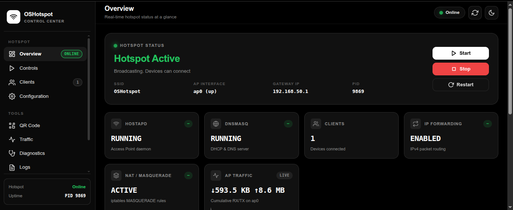

# OSHotspot

[](LICENSE)
[](https://linux.org)
[](https://www.gnu.org/software/bash/)
[](https://github.com/King03-sam/OSHotspot)
[](https://github.com/King03-sam/OSHotspot/pulls)

<p align="center">
  <b>Automatic WiFi Hotspot Manager for Linux</b><br>
  Share your computer's WiFi Internet connection with any device, even when NetworkManager hotspot fails.
</p>

OSHotspot fixes broken WiFi hotspot sharing on Linux when NetworkManager's built-in hotspot fails — one command, no NetworkManager conflicts.

---

## About OSHotspot

OSHotspot is a lightweight Linux automation tool designed to create a working WiFi hotspot using native networking tools:

- `hostapd` → WiFi Access Point management
- `dnsmasq` → Dedicated DHCP and DNS service
- `iptables` → Internet connection sharing (NAT)
- `iw` → Virtual WiFi interface management

This project was created after facing a real Linux networking limitation where the default Ubuntu hotspot feature could not share an active WiFi connection correctly.

OSHotspot provides a reliable alternative by creating a virtual Access Point interface (`ap0`) and routing Internet traffic through the existing WiFi connection, without disabling NetworkManager.

If you have searched for terms like *"networkmanager hotspot not working"* or *"linux wifi hotspot broken"*, this project was built to address those exact failure modes. It is also useful when you need to **share wifi internet linux** without router hardware, or when you are looking for a **hostapd dnsmasq tutorial script** packaged as a single, reusable CLI.

---

## Use Cases

- Your NetworkManager hotspot creates a network but connected devices get no internet.
- You need to share your laptop's WiFi internet with a phone or another laptop with no router available.
- You want a persistent, auto-repairing hotspot that survives suspend/resume.

---

## Web Dashboard



A **modern web dashboard** launched with a single command:

```bash
sudo oshotspot web
```

The browser opens automatically with a secure, token-authenticated session. The dashboard provides full hotspot management without touching the terminal.

| Page | What it does |
|------|-------------|
| **Overview** | Live status, service health, network info, traffic sparkline |
| **Traffic** | Real-time bandwidth chart with download/upload speeds and totals |
| **Controls** | Start / stop / restart / repair with real-time output |
| **Clients** | Connected devices table with kick/block and unblock actions |
| **Configuration** | SSID, password, channel, hardware mode, country code with 5GHz compatibility warning |
| **QR Code** | Scannable WiFi QR for instant phone connections |
| **Diagnostics** | System readiness checks |
| **Logs** | Live hostapd / dnsmasq / web log viewer |

---

## Creator

OSHotspot was created by **OLOJEDE Samuel**. Contributions from the community are welcome and appreciated.

I also created [**OS AI Chat**](https://osaix.vercel.app) and [**OS AI Agent**](https://osaix.vercel.app/agent) (a CLI AI agent).

The project was developed to provide an automated and reliable WiFi hotspot solution for Linux systems using native networking tools.

---

# Features

- Automatic WiFi hotspot creation with one command
- Internet sharing from an existing WiFi connection
- Works alongside NetworkManager (never disables it)
- Dedicated dnsmasq instance (no conflicts with Docker, LXC, or libvirt)
- Virtual AP interface (`ap0`) created via `iw` and `nl80211`
- Automatic iptables NAT and forwarding rules
- 802.11n support for better device compatibility
- Suspend/resume auto-repair
- Simple CLI: `oshotspot start / stop / status / repair / clients / monitor / qr / doctor / web`
- Web dashboard for browser-based management (`oshotspot web`)
- Kick & block clients — disconnect a device and prevent reconnection via MAC deny list
- 5GHz compatibility warning — warns if adapter doesn't support 5GHz when that mode is selected
- Dark / light theme toggle in the dashboard
- Responsive dashboard design — works on mobile and desktop
- Diagnostic tool to verify system readiness (`oshotspot doctor`)
- Auto-detection of WiFi interfaces (supports wlan0, wlp2s0, wlx...)
- Real-time bandwidth chart with download/upload speed, total transferred, and live canvas chart
- QR code display to share hotspot with phones instantly
- Bash tab completion for the CLI
- Supports Ubuntu, Debian, Mint, Fedora, Arch, and more

---

# How it works

OSHotspot creates a virtual WiFi access point on the same adapter that provides your Internet connection. Your computer acts as a router between the two networks.

```
              Internet
                 |
                 |
          Existing WiFi
           wlp2s0
                 |
           Linux Laptop
            (router)
                 |
          Virtual AP Interface
               ap0
           192.168.50.1
                 |
            Smartphone
         192.168.50.x
```

Traffic flow:

```
  Phone (192.168.50.x)
       |
       | WiFi
       |
     ap0
       |
  iptables NAT (MASQUERADE)
       |
     wlp2s0
       |
       | WiFi
       |
  Internet Router
       |
     Internet
```

OSHotspot does NOT disable NetworkManager. Your laptop keeps its original WiFi connection and simultaneously broadcasts a second network through `ap0`.

---

# Requirements

## Hardware

Your wireless adapter must support **AP mode**.

Check with:

```bash
iw list
```

Look for:

```
Supported interface modes:
        * AP
```

Example supported hardware:

- Intel Wireless 7265
- Intel AX200 / AX210
- Many modern Linux-compatible WiFi adapters

## Software

Required packages:

```bash
sudo apt install hostapd dnsmasq iw iptables iproute2 qrencode
```

---

# Installation

One-liner install:

```bash
curl -fsSL https://raw.githubusercontent.com/King03-sam/OSHotspot/main/install.sh | sudo bash
```

Or clone and install manually:

```bash
git clone https://github.com/King03-sam/OSHotspot.git
cd OSHotspot
chmod +x install.sh oshotspot
sudo ./install.sh
```

The installer will:

1. Install `hostapd`, `dnsmasq`, `iw`, `iptables`, `iproute2`, `qrencode`
2. Create configuration directory at `/etc/oshotspot/`
3. Install the `oshotspot` CLI to `/usr/local/bin/`
4. Set up systemd services and suspend/resume hooks

---

# Configuration

Edit the configuration file:

```bash
sudo nano /etc/oshotspot/config.conf
```

Or use the CLI:

```bash
sudo oshotspot set ssid MyWiFi
sudo oshotspot set password MySecretPassword
```

When the hotspot is running, changes are applied automatically (hotspot restarts).

### Configuration Options

| Key | Default | Description |
|-----|---------|-------------|
| `SSID` | `OSHotspot` | WiFi network name (1-32 characters) |
| `PASSWORD` | `ChangeMe123` | WiFi password (minimum 8 characters, WPA2) |
| `CHANNEL` | `6` | WiFi channel (1-13) |
| `HW_MODE` | `g` | Hardware mode (`g` for 2.4GHz, `a` for 5GHz) |
| `COUNTRY_CODE` | `FR` | Country code (FR, US, GB...) - required by some drivers |
| `WIFI_IFACE` | *(auto-detected)* | Your internet WiFi interface |
| `AP_IP` | `192.168.50.1` | Hotspot gateway IP |
| `DHCP_RANGE_START` | `192.168.50.10` | DHCP range start |
| `DHCP_RANGE_END` | `192.168.50.100` | DHCP range end |
| `DNS_PRIMARY` | `8.8.8.8` | Primary DNS server |
| `DNS_SECONDARY` | `1.1.1.1` | Secondary DNS server |

---

# Start Hotspot

```bash
sudo oshotspot start
```

Your phone should see:

```
OSHotspot
```

Connect using the configured password.

# Stop Hotspot

```bash
sudo oshotspot stop
```

# Check Status

```bash
sudo oshotspot status
```

Displays: WiFi interface, AP status, hostapd status, dnsmasq status, IP forwarding, NAT rules, and connected clients.

# Show Connected Clients

```bash
sudo oshotspot clients
```

Displays a list of all devices connected to the hotspot with their MAC address, IP address, hostname, and connection status.

# Real-time Monitoring

```bash
sudo oshotspot monitor
```

Live monitoring view that refreshes every 3 seconds showing:

- Connected clients with MAC, IP, hostname
- AP interface traffic (RX/TX bytes and speed)
- hostapd and dnsmasq status

Press `Ctrl+C` to quit.

# Repair Hotspot

After suspend, resume, or driver issues:

```bash
sudo oshotspot repair
```

This will stop broken components, wait for the WiFi interface to reappear, recreate the AP interface, and restart everything.

# Restart Hotspot

```bash
sudo oshotspot restart
```

# Show QR Code

```bash
sudo oshotspot qr
```

Displays a QR code in the terminal that your phone can scan to connect to the hotspot instantly. No need to type the password manually.

# Web Dashboard

Launch the full-featured web dashboard:

```bash
sudo oshotspot web
```

A lightweight Python server starts on `127.0.0.1` and your browser opens automatically. No pip packages needed — just Python 3.

### Pages

- **Overview** — Live status of hostapd, dnsmasq, IP forwarding, NAT. Connected client count (active only). Network info and traffic sparkline.
- **Traffic** — Real-time bandwidth chart showing download/upload speed, total data transferred, and a live canvas chart with auto-scaling axes and filled area under the curve. 5 stat cards: Download Speed, Upload Speed, Total Down, Total Up, Active Clients.
- **Controls** — One-click start / stop / restart / repair with real-time console output streamed to the browser.
- **Clients** — Auto-refreshing table (MAC, IP, hostname, status). **Kick** a client to disconnect them and add their MAC to the deny list. **Unblock** to restore access.
- **Configuration** — Edit SSID, password, channel, hardware mode (2.4/5 GHz), country code. Server-side validation with live feedback. 5GHz warning if your adapter doesn't support it.
- **QR Code** — Scannable WiFi QR code for instant phone connections.
- **Diagnostics** — Run `oshotspot doctor` from the browser.
- **Logs** — Live hostapd, dnsmasq, and web server log viewer with auto-scroll.

### Security

- Binds to `127.0.0.1` only (no external network exposure)
- Random session token generated per launch (never persisted)
- Token required on every API request
- Auto-shutdown after 2 hours of inactivity
- All config changes validated server-side before writing

# Diagnostic

```bash
sudo oshotspot doctor
```

Runs a full diagnostic check on your system:

```
OSHotspot Diagnostic v1.0

  [OK]    WiFi adapter detected (wlp2s0)
  [OK]    AP mode supported (phy0)
  [OK]    hostapd installed
  [OK]    dnsmasq installed
  [OK]    qrencode installed
  [OK]    IP forwarding enabled
  [OK]    NAT configured
  [OK]    Configuration file exists
  [OK]    NetworkManager configured
  [WARN]  Hotspot is not running

  Passed: 9  Warnings: 1  Failed: 0
  System is ready.
```

# List WiFi Interfaces

```bash
sudo oshotspot interfaces
```

Shows all available WiFi adapters on your system. Useful when you have multiple adapters (built-in + USB):

```
Available WiFi interfaces:

  wlp2s0          up       18:5e:0f:c7:90:48
  wlx1234567890   down     aa:bb:cc:dd:ee:ff
```

# Choose WiFi Interface

If you have multiple WiFi adapters, tell OSHotspot which one to use for internet:

```bash
sudo oshotspot set wifi_iface wlp2s0
```

---

# Systemd

After installation, you can also manage the hotspot with systemd:

```bash
sudo systemctl start oshotspot
sudo systemctl stop oshotspot
sudo systemctl status oshotspot
```

A suspend/resume hook is automatically installed so the hotspot repairs itself after the laptop wakes up.

---

# Bash Completion

Tab completion is installed automatically. After installation, press `<TAB>` to auto-complete commands:

```bash
sudo oshotspot <TAB>
# start  stop  restart  repair  status  clients  monitor  config  qr  doctor  interfaces  set  help

sudo oshotspot set <TAB>
# ssid  password  wifi_iface
```

If completion doesn't work immediately, run:

```bash
source /etc/bash_completion.d/oshotspot
```

---

# Uninstallation

```bash
sudo ./uninstall.sh
```

Or manually:

```bash
sudo oshotspot stop
sudo rm /usr/local/bin/oshotspot
sudo rm -rf /usr/lib/oshotspot
sudo rm -f /etc/sysctl.d/oshotspot.conf
sudo rm -f /etc/systemd/system/oshotspot*.service
sudo systemctl daemon-reload
sudo rm -rf /etc/oshotspot
sudo rm -rf /var/log/oshotspot
```

---

## FAQ

### Why does my NetworkManager hotspot show no internet access?

Because NetworkManager's built-in hotspot often fails to set up proper internet sharing when the same WiFi adapter is used for both client and AP roles. OSHotspot solves this by using `hostapd`, `dnsmasq`, and `iptables` directly.

### Can I run a WiFi hotspot without disabling my main WiFi connection?

Yes. OSHotspot creates a virtual AP interface (`ap0`) and keeps your existing WiFi connection active. NetworkManager is never disabled.

### Does OSHotspot work after my laptop wakes from sleep?

Yes. A suspend/resume hook is installed automatically, and the `oshotspot repair` command can restore the hotspot if needed after waking.

---

# Troubleshooting

## Phone connects but no Internet

Check IP forwarding:

```bash
cat /proc/sys/net/ipv4/ip_forward
```

Expected:

```
net.ipv4.ip_forward = 1
```

Check iptables rules:

```bash
sudo iptables -L FORWARD -v
sudo iptables -t nat -L POSTROUTING -v
```

Verify the WiFi interface has internet access:

```bash
ping -I wlp2s0 8.8.8.8
```

## DHCP stuck on "Obtaining IP address"

Check if dnsmasq is running:

```bash
sudo oshotspot status
```

Check for conflicting services on port 67:

```bash
sudo ss -lunp | grep :67
```

If another dnsmasq instance is blocking:

```bash
sudo oshotspot restart
```

## hostapd errors

Check the log:

```bash
sudo cat /var/log/oshotspot/hostapd.log
```

Common causes:

- Another hostapd instance is already running
- The AP interface was not created
- The WiFi adapter does not support the configured mode

## dnsmasq conflicts with existing services

OSHotspot runs its **own dedicated dnsmasq instance** that only serves the `ap0` interface. It does **not** use `systemctl restart dnsmasq` and will not interfere with:

- libvirt / LXC dnsmasq
- Docker's built-in DNS
- NetworkManager's DNS

## Interface ap0 fails to create

Check your driver supports virtual interfaces:

```bash
iw phy phy0 info
```

Try deleting the interface first:

```bash
sudo iw dev ap0 del
sudo oshotspot start
```

Some drivers need the WiFi to be disconnected first:

```bash
sudo nmcli device disconnect wlp2s0
sudo oshotspot start
```

## Suspend / resume problems

After resuming from sleep:

```bash
sudo oshotspot repair
```

This will:

1. Stop any broken components
2. Wait for the WiFi interface to reappear
3. Recreate the AP interface
4. Restart hostapd, dnsmasq, and firewall rules

## No WiFi interface found

Your adapter may not be detected:

```bash
iwconfig
ip link
sudo systemctl restart NetworkManager
```

## Adapter does not support AP mode

```bash
iw phy phy0 info | grep -A 10 "Supported interface modes"
```

Look for `AP` in the output. If missing, you need a different adapter or driver.

## Phone connects then disconnects after a few seconds

This is usually caused by missing 802.11n settings or country code.

Check your hostapd config:

```bash
sudo cat /etc/oshotspot/hostapd.conf
```

Make sure these lines are present:

```
country_code=FR
ieee80211n=1
ht_capab=[HT20][SHORT-GI-20]
```

Change `FR` to your country code. Then restart:

```bash
sudo oshotspot stop
sudo oshotspot start
```

## Hostname does not change

The hostname is configured in `/etc/oshotspot/config.conf` via the `HOSTNAME` field. It does not change the system hostname automatically.

---

# Why not NetworkManager hotspot?

Ubuntu NetworkManager hotspot works for many users, but some WiFi adapters or drivers have limitations when:

- The laptop receives Internet through WiFi
- The same adapter must create another WiFi network
- Virtual AP interfaces are required

OSHotspot uses a lower-level approach with `hostapd`, `dnsmasq`, and `iptables` to bypass these limitations, while keeping NetworkManager running for the original connection.

This makes OSHotspot a practical **create access point linux** alternative for users who have tried the built-in NetworkManager option and found it insufficient. It also serves as a reliable fallback when searching for **ubuntu hotspot alternative** solutions that do not require disabling your primary WiFi connection.

---

# Supported distributions

Tested on:

- Ubuntu 18.04+
- Debian 10+
- Linux Mint
- Fedora
- Arch Linux

Any distribution with `hostapd`, `dnsmasq`, `iw`, and `iptables` should work.

---

# Project structure

```
OSHotspot/
├── README.md
├── LICENSE
├── install.sh
├── uninstall.sh
├── oshotspot                    # Main CLI
├── config.conf.example          # Configuration template
├── public/
│   └── dashboard.png            # Dashboard screenshot
├── scripts/
│   ├── utils.sh                 # Shared functions
│   ├── firewall.sh              # iptables NAT management
│   ├── start.sh                 # Start hotspot
│   ├── stop.sh                  # Stop hotspot
│   ├── repair.sh                # Repair after suspend
│   ├── status.sh                # Status display
│   ├── clients.sh               # Show connected clients
│   ├── monitor.sh               # Real-time monitoring
│   ├── qr.sh                    # QR code display
│   ├── logs.sh                  # View hotspot logs
│   ├── web.sh                   # Web dashboard launcher
│   └── doctor.sh                # Diagnostic tool
├── web/
│   ├── serve.py                 # Python entry point
│   ├── server/                  # Server package
│   │   ├── __init__.py
│   │   ├── auth.py              # Session token auth
│   │   ├── config_store.py      # Config file management
│   │   ├── handler.py           # HTTP request handler (API routes)
│   │   ├── main.py              # Server startup
│   │   ├── network_info.py      # Network status & 5GHz detection
│   │   ├── parsers.py           # hostapd/dnsmasq log parsers
│   │   ├── scripts.py           # CLI script wrappers
│   │   └── settings.py          # Server settings
│   └── static/
│       ├── index.html           # Dashboard page
│       ├── style.css            # Dashboard styles
│       └── js/                  # Dashboard JavaScript modules
│           ├── app.js           # Main entry point
│           ├── api.js           # API client
│           ├── core.js          # Core utilities
│           ├── status.js        # Status panel
│           ├── actions.js       # Start/stop/restart controls
│           ├── clients.js       # Connected clients + kick/block
│           ├── config.js        # Configuration editor + 5GHz warning
│           ├── doctor.js        # Diagnostics panel
│           ├── logs.js          # Log viewer
│           ├── nav.js           # Navigation
│           ├── qr.js            # QR code display
│           ├── theme.js         # Dark/light theme toggle
│           ├── toast.js         # Toast notifications
│           └── traffic.js       # Bandwidth chart (download/upload speeds + totals)
├── configs/
│   ├── hostapd.conf.template    # hostapd config template
│   ├── dnsmasq.conf.template    # dnsmasq config template
│   └── nm-oshotspot.conf        # NetworkManager ignore ap0
├── completions/
│   ├── oshotspot                # Bash tab completion
│   ├── oshotspot.zsh            # Zsh tab completion
│   └── oshotspot.fish           # Fish tab completion
└── systemd/
    ├── oshotspot.service        # Main systemd unit
    └── oshotspot-dnsmasq.service
```

---

# Roadmap

Future improvements:

- Automatic driver compatibility check
- Multi-language support
- Bandwidth limiting per client

---

# License

Copyright 2026 OLOJEDE Samuel

Licensed under the Apache License, Version 2.0 (the "License");
you may not use this file except in compliance with the License.
You may obtain a copy of the License at:

http://www.apache.org/licenses/LICENSE-2.0

Unless required by applicable law or agreed to in writing, software
distributed under the License is distributed on an "AS IS" BASIS,
WITHOUT WARRANTIES OR CONDITIONS OF ANY KIND, either express or implied.
See the License for the specific language governing permissions and
limitations under the License.

See the [LICENSE](LICENSE) file for the full license text.

---

# Acknowledgments

Thanks to the Linux networking community and open-source projects:

- [hostapd](https://w1.fi/hostapd/)
- [dnsmasq](https://thekelleys.org.uk/dnsmasq/doc.html)
- [iw](https://wireless.kernel.org/en/users/Documentation/iw)
- [iptables](https://www.netfilter.org/)

Made with Linux and passion by **OLOJEDE Samuel**
