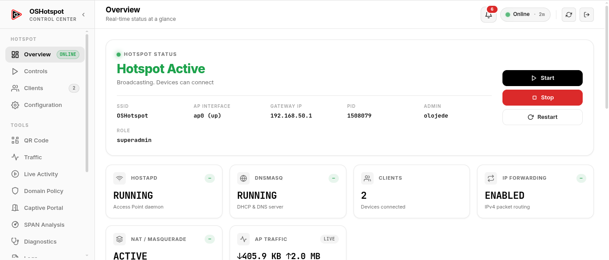

<p align="center">
  
</p>

# OSHotspot

[]()
[](LICENSE)
[](https://linux.org)
[](https://www.gnu.org/software/bash/)
[]()
[](https://www.python.org/)
[](https://w1.fi/hostapd/)
[]()
[](https://github.com/King03-sam/OSHotspot)
[](https://github.com/King03-sam/OSHotspot/pulls)

<p align="center">
<b>WiFi Hotspot & Network Security Manager for Linux</b><br>
Create WiFi hotspots, monitor DNS traffic, enforce domain policies, detect network anomalies, and block encrypted DNS bypass.
</p>

> **Big update, October 2026:** after 2 months of quiet work, this sync brings the full OSHotspot stack (dashboard, live Events, authentication, captive portal, VPN, mail alerts, audit), about 4 months of development since the project began. See "What's new in this update" below.

## What's new in this update

- **Dashboard**: real-time overview, traffic, clients, logs and diagnostics in one control center.
- **Live Events**: DNS and DHCP activity streamed over SSE with a 5 minute live view plus searchable history.
- **Authentication and audit**: token sessions, role based access, brute force lockout and a full admin action trail.
- **Captive portal**: voucher codes with PDF export and a live session status view.
- **Domain policy and IDS**: forbidden and watched domains, SPAN analysis and DoH bypass blocking.
- **VPN and mail**: Tailscale remote access and SMTP email alerts from the dashboard.

<p align="center">
  
  <br>
  <em>The OSHotspot web dashboard: live overview, traffic, clients, SPAN analysis, domain policy and more.</em>
</p>

OSHotspot fixes broken WiFi hotspot sharing on Linux when NetworkManager's built-in hotspot fails. It provides automated Access Point creation, customizable Captive Portals, and a standalone SPAN Port Network Traffic & Intrusion Detection System (IDS).

---

## About OSHotspot

OSHotspot is a lightweight Linux networking tool that creates a working WiFi hotspot using native networking tools:

- `hostapd` → WiFi Access Point management
- `dnsmasq` → Dedicated DHCP and DNS service
- `iptables` / `nftables` → NAT, DNS redirect, DoH/DoT/VPN blocking
- `iw` → Virtual WiFi interface management (`ap0`)
- `span_analyzer` → Raw packet inspection & anomaly detection (IDS)
- `Python 3 + SSE` → Real-time web dashboard with live event streaming

---

## Key Features

- **WiFi AP with NAT & DNS**: One-command hotspot creation with hostapd + dnsmasq, NAT masquerade, and DHCP.
- **DNS Traffic Intelligence**: Real-time DNS query categorization (messaging, social, entertainment, browsing), noise filtering, and session aggregation for clean event logs.
- **Domain Policy Enforcement**: Forbidden/watched domain patterns with SMTP email alerts, instant high-priority notifications, and live SSE dashboard updates.
- **Application Category Blocking**: Block entire app categories (messaging, gaming) by network port and TLS SNI inspection; works even if clients use external DNS or cached IPs.
- **SPAN Port IDS Analyzer**: Raw packet capture on any interface that detects ARP spoof, port scan, SYN flood, ICMP flood, and traffic burst with live anomaly stream.
- **Captive Portal System**: Atomic batch voucher code generation (1-50 codes, custom prefixes), First-Use Activation Model (duration starts on first connect), printable A4 PDF vouchers with admin branding, live User Session Status dashboard with glowing white progress bar countdown, permanent code password masking, CORS preflight support, and OS probe handling (iOS/Android/Windows/macOS).
- **Secure Admin Dashboard**: Token + HttpOnly session cookie auth, PBKDF2-HMAC-SHA256 password hashing, role-based access (superadmin/admin), per-user + per-IP brute-force lockout (IP blocks never disclosed).
- **Comprehensive Audit Trail**: Every admin action is logged (user, role, timestamp, IP, success/failure), viewable in a dedicated page with filters, pagination, and bulk delete. 90-day rolling retention, cleanup every 72 hours. Superadmin can grant audit access to other admins.
- **Device Inventory**: Auto-detect unknown devices, label known clients, bulk import/export, MAC deny list with kick/unblock.
- **Live Bandwidth Monitor**: Real-time upload/download speeds, total RX/TX counters, Canvas sparkline chart.
- **Network Security Hardening**: DNS-over-HTTPS/DoT blocking, VPN protocol blocking (WireGuard, OpenVPN, IPsec), DNS port 53 redirect via iptables/nftables.
- **Remote Access via Tailscale VPN**: Access the dashboard remotely from any device on your Tailscale mesh network with no port forwarding required. Start/stop/restart VPN from the dashboard with authentication URL support.
- **Channel Scanner**: WiFi channel analysis with congestion ranking (1/6/11), 5 GHz support detection, adaptive hostapd config generation.
- **QR Code & Diagnostics**: Scannable WiFi QR code, system doctor with auto-repair, live log viewer, systemd auto-start.
- **CLI + Web Dashboard**: 22 CLI commands (`start`, `stop`, `repair`, `monitor`, `scan`, `qr`, `logs`, `doctor`, `web`, `set`, `setup-vpn`, `setup-mail`...) and an 18-view vanilla JS SPA dashboard with no Node.js, no npm, and no build step. Application category blocking controls are embedded in the Domain Policy page.

---

## Web Dashboard Pages

Launch the dashboard with:

```bash
sudo oshotspot web
```

The dashboard listens on port `8073`.

| Page | Description |
|------|-------------|
| **Overview** | Live status, hostapd/dnsmasq health, active client count, traffic sparklines |
| **Traffic Monitor** | Real-time upload/download bandwidth charts with total RX/TX statistics |
| **Controls** | Start, stop, restart, and repair hotspot services with live console output |
| **Clients** | Connected devices table with kick, MAC blocking, known device labeling, and bulk import |
| **Captive Portal** | Configure access codes (with progressive rate limiting: +60s lockout every 5 failed attempts, capped at 1h), guest mode, custom logo, background color, and welcome message |
| **SPAN Analysis** | Switch mirror port, packet metrics, real-time traffic & anomaly stream, anomaly history (last 100) |
| **Configuration** | Edit SSID, password, channel, country code, remote access, inactivity timeout, logos, colors |
| **Domain Policy** | Edit wildcard lists for domain blocking, watched domains, and noise filtering with bulk import; application category blocking (messaging, gaming) by port and SNI |
| **Live Activity** | Real-time DNS/HTTP/TLS/alert stream delivered via Server-Sent Events (SSE) |
| **Events** | Live events feed, historical event search (type/MAC/time filters), and known devices inventory |
| **User Management** | Create/delete admin accounts, role assignment (superadmin/admin), password reset (superadmin only) |
| **Audit Log** | Admin action history with filters, pagination, and bulk delete (superadmin or granted audit access) |
| **QR Code** | Scannable terminal & browser WiFi QR code for instant mobile connections |
| **Diagnostics** | Run system readiness tests (`oshotspot doctor`) with one-click repair |
| **Logs** | Live hostapd, dnsmasq, web server, and event log viewer with auto-refresh |
| **Email Alerts** | Configure SMTP email alerts for domain policy violations and network anomalies (msmtp or direct SMTP) |
| **VPN** | Tailscale VPN status, connected devices, start/stop/restart controls, remote access setup guide |
| **About** | Version, author, license, technology stack, and features overview |

---

## CLI Quick Reference

```bash
sudo oshotspot start       # Start WiFi hotspot and NAT routing
sudo oshotspot stop        # Stop hotspot services
sudo oshotspot restart     # Restart hotspot and reload configuration
sudo oshotspot status      # Display real-time status and connected devices
sudo oshotspot clients     # List connected devices with MAC & IP
sudo oshotspot monitor     # Terminal live monitoring dashboard (TUI)
sudo oshotspot repair      # Automatic network repair & recovery
sudo oshotspot web         # Launch web management dashboard
sudo oshotspot doctor      # System readiness diagnostic
sudo oshotspot interfaces  # List available WiFi network adapters
sudo oshotspot scan        # Scan WiFi channels and recommend best channel
sudo oshotspot qr          # Print scannable terminal WiFi QR code
sudo oshotspot logs        # View and follow hotspot logs (--follow, --lines=N)
sudo oshotspot enable      # Enable auto-start at boot via systemd
sudo oshotspot disable     # Disable auto-start at boot
sudo oshotspot update      # Update OSHotspot to latest version
sudo oshotspot config      # Print current configuration
sudo oshotspot config reset # Restore config from example template
sudo oshotspot set ssid <name>       # Change hotspot SSID (auto-restart if running)
sudo oshotspot set password <pass>   # Change hotspot password (auto-restart if running)
sudo oshotspot set wifi_iface <iface> # Set internet WiFi adapter
sudo oshotspot setup-vpn            # Install and configure Tailscale VPN for remote access
sudo oshotspot setup-mail           # Configure email alerts (msmtp or direct SMTP)
sudo oshotspot uninstall [--purge]  # Remove OSHotspot (--purge removes config & logs)
```

---

## Quick Installation

> **Note**: This repository is private. You must have access to
> `King03-sam/OSHotspot` on GitHub to use the installer.

One-liner install:

```bash
curl -fsSL https://raw.githubusercontent.com/King03-sam/OSHotspot/main/install.sh | sudo bash
```

Or manual install:

```bash
git clone https://github.com/King03-sam/OSHotspot.git
cd OSHotspot
chmod +x install.sh oshotspot
sudo ./install.sh
```

---

## Technical Documentation

For complete technical specifications, architecture details, and API references, see [oshotsop-private-fuc.md](oshotsop-private-fuc.md).

---

## License

Copyright 2026 OLOJEDE Samuel. Licensed under the [Apache License 2.0](LICENSE).
